# Confluent Platform 실습 프로젝트

## 목차

- [Confluent Platform이란?](#confluent-platform이란)
- [아키텍처](#아키텍처)
- [사전 준비](#사전-준비)
- [빠른 시작](#빠른-시작)
- [실행 방법: 로컬 vs Docker](#실행-방법-로컬-vs-docker)
- [Step 1: 이벤트 스트리밍 기초](#step-1-이벤트-스트리밍-기초) — Producer, Consumer, Consumer Group, Partition, Offset
- [Step 2: 실시간 데이터 파이프라인 (CDC)](#step-2-실시간-데이터-파이프라인-cdc) — Kafka Connect, Debezium, Change Data Capture
- [Step 3: 스트림 프로세싱 (ksqlDB)](#step-3-스트림-프로세싱-ksqldb) — SQL 기반 실시간 집계/필터링
- [Step 4: Avro → JSON 변환 (QRadar 연동 검증)](#step-4-avro--json-변환-qradar-연동-검증) — 바이너리 → 텍스트 포맷 변환
- [프로젝트 구조](#프로젝트-구조)
- [포트 정리](#포트-정리)
- [종료](#종료)

---

## Confluent Platform이란?

**Apache Kafka**는 대규모 실시간 데이터 스트리밍을 위한 분산 메시징 시스템입니다. **Confluent Platform**은 Kafka를 중심으로 실무에 필요한 도구들을 묶은 통합 플랫폼입니다.

| 컴포넌트 | 역할 | 비유 |
|----------|------|------|
| **Kafka Broker** | 메시지를 저장하고 전달하는 핵심 서버 | 우체국 |
| **Producer** | Kafka에 메시지를 보내는 클라이언트 | 편지를 보내는 사람 |
| **Consumer** | Kafka에서 메시지를 읽는 클라이언트 | 편지를 받는 사람 |
| **Topic** | 메시지가 저장되는 카테고리 | 우편함 |
| **Partition** | Topic을 분할한 단위 (병렬 처리의 핵심) | 우편함의 칸 |
| **Schema Registry** | 메시지 형식(스키마)을 중앙 관리 | 편지 양식 관리소 |
| **Kafka Connect** | 외부 시스템과 Kafka 간 데이터 연동 | 자동 우편 배달 시스템 |
| **ksqlDB** | SQL로 실시간 스트림 데이터를 처리 | 실시간 편지 분류기 |
| **Control Center** | 웹 UI로 전체 플랫폼을 모니터링 | 관제 대시보드 |

이 프로젝트는 **쇼핑몰 주문 시나리오**를 통해 위 컴포넌트들을 단계별로 체험합니다.

---

## 아키텍처

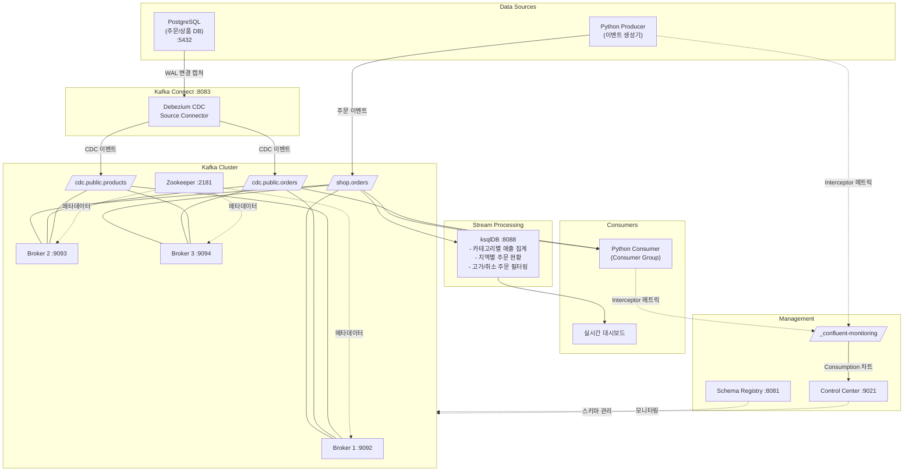

### 데이터 흐름

데이터는 **두 가지 경로**로 Kafka에 유입되고, 실시간으로 처리됩니다.

**경로 1 - 애플리케이션 이벤트** (Python Producer → Kafka)
- Producer가 주문 이벤트를 생성하여 `shop.orders` 토픽에 전송합니다.
- 실제 서비스에서 백엔드가 Kafka에 직접 이벤트를 발행하는 패턴입니다.

**경로 2 - CDC (Change Data Capture)** (PostgreSQL → Debezium → Kafka)
- PostgreSQL의 INSERT/UPDATE/DELETE가 Debezium을 통해 자동으로 Kafka 토픽에 캡처됩니다.
- 애플리케이션 코드 수정 없이 DB 변경을 실시간 스트리밍할 수 있습니다.

**실시간 처리** (Kafka → ksqlDB / Consumer)
- **ksqlDB**가 SQL로 실시간 집계 (카테고리별 매출, 지역별 주문, 고가 주문 필터링)
- **Consumer Group**이 파티션을 분배하여 병렬로 메시지를 소비

**인프라**
- Kafka 3 Broker 구성으로 데이터 복제(Replication Factor=3)와 고가용성 보장
- Broker에 **Metrics Reporter**가 설정되어 Control Center에서 실시간 모니터링 가능

---

## 사전 준비

- **Docker Desktop** - 메모리 8GB 이상 할당 권장 (컨테이너 11개 구동)
- **Python 3.9+**

---

## 빠른 시작

### 1단계: 환경 구동

```bash
# Confluent Platform 전체 스택 시작 (최초 실행 시 이미지 다운로드로 수 분 소요)
docker-compose up -d

# 모든 서비스가 Running 상태인지 확인 (1~2분 대기)
docker-compose ps
```

### 2단계: Python 환경 설정

```bash
python3 -m venv venv
source venv/bin/activate
pip install -r requirements.txt
```

> macOS Homebrew Python은 가상환경(venv) 없이 pip install하면 `externally-managed-environment` 에러가 발생합니다.

### 3단계: Control Center 접속

브라우저에서 **http://localhost:9021** 접속 → 클러스터 상태, 토픽, 메시지, 커넥터를 웹 UI로 확인할 수 있습니다.

---

## 실행 방법: 로컬 vs Docker

Python 스크립트는 **로컬(macOS)**과 **Docker 컨테이너(Linux)** 두 가지 방식으로 실행할 수 있습니다.
`config.py`가 실행 환경을 자동 감지하여 Kafka 접속 정보와 Monitoring Interceptor 설정을 자동으로 전환합니다.

### 로컬 실행 (macOS)

```bash
python step1_basics/01_producer.py
```

### Docker 컨테이너 실행 (Monitoring Interceptor 활성화)

```bash
# 최초 1회: 컨테이너 빌드 (x86_64 에뮬레이션으로 빌드, 수 분 소요)
docker-compose up -d --build python-app

# 컨테이너 안에서 스크립트 실행
docker exec -it python-app python step1_basics/01_producer.py
docker exec -it python-app python step1_basics/02_consumer.py
```

### 비교

| 항목 | 로컬 (macOS) | Docker 컨테이너 (Linux) |
|------|-------------|------------------------|
| Kafka 접속 | localhost:9092 | broker1:29092 (자동) |
| Monitoring Interceptor | 비활성화 (arm64 미지원) | 자동 활성화 |
| Control Center Consumption 탭 | Consumer Lag 탭으로 대체 | 차트 표시됨 |
| 실행 속도 | 네이티브 | x86_64 에뮬레이션 (약간 느림) |

### Monitoring Interceptor란?

Producer/Consumer의 메시지 송수신을 가로채서 메트릭을 `_confluent-monitoring` 토픽에 발행하는 플러그인입니다. Control Center가 이 토픽을 읽어서 Consumption 차트(% messages consumed, End-to-end latency)를 렌더링합니다.

Confluent의 `confluent-librdkafka-plugins` 패키지는 **x86_64(amd64)** 바이너리만 제공하므로, Apple Silicon Mac에서는 Docker 컨테이너를 `--platform=linux/amd64`로 빌드하여 Rosetta 에뮬레이션으로 실행합니다. (`Dockerfile.python` 참조)

> 참고: [Confluent 공식 문서 - Monitoring Interceptor 설정](https://docs.confluent.io/platform/7.6/control-center/installation/clients.html)

---

## Step 1: 이벤트 스트리밍 기초

> Kafka의 핵심 개념인 **Producer, Consumer, Consumer Group, Partition, Offset**을 학습합니다.

### 실행

```bash
# 1-1. Producer: 주문 이벤트 6건 전송
docker exec -it python-app python step1_basics/01_producer.py

# 1-2. Consumer: 전송된 이벤트 소비 (다른 터미널에서)
docker exec -it python-app python step1_basics/02_consumer.py

# 1-3. Consumer Group: 파티션 분배 관찰 (터미널 3개에서 각각 실행)
docker exec -it python-app python step1_basics/03_consumer_group_demo.py --id worker-1
docker exec -it python-app python step1_basics/03_consumer_group_demo.py --id worker-2
docker exec -it python-app python step1_basics/03_consumer_group_demo.py --id worker-3

# 1-4. 연속 이벤트 생성기 (Step 2, 3에서도 사용)
docker exec -it python-app python step1_basics/04_producer_advanced.py
```

### 실행 화면

**Producer** - Key 기반 파티셔닝으로 같은 고객의 주문이 같은 파티션에 저장됩니다.

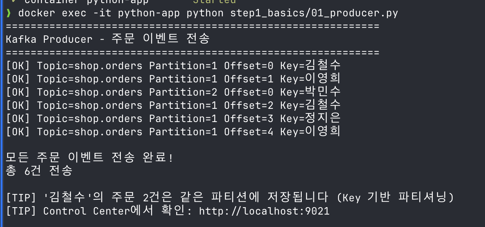

**Consumer** - 메시지를 순서대로 소비하며 Offset을 커밋합니다.

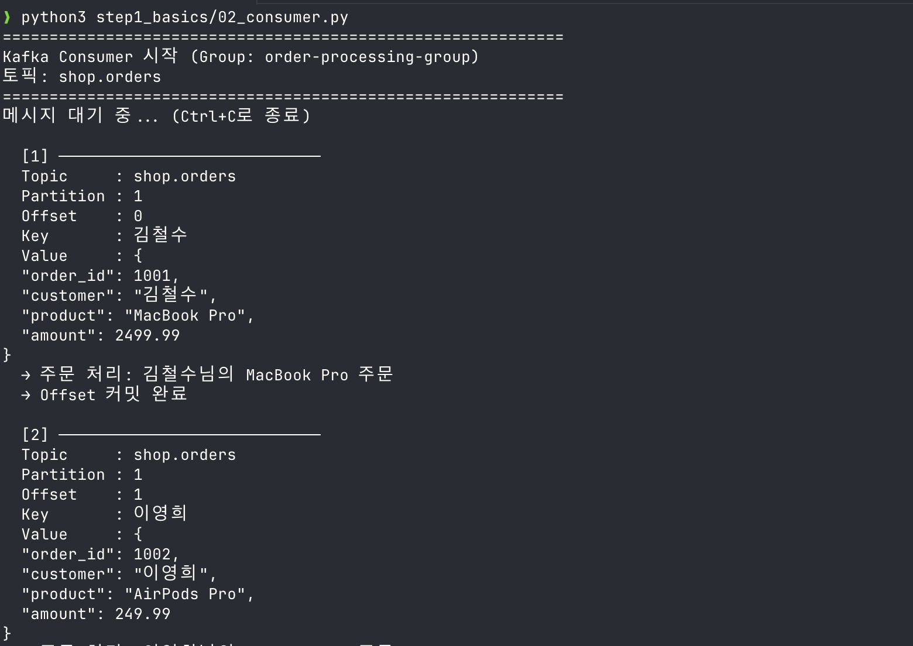

**Control Center - Topic Overview** - 파티션별 Leader/Follower 배치와 Offset을 확인할 수 있습니다.

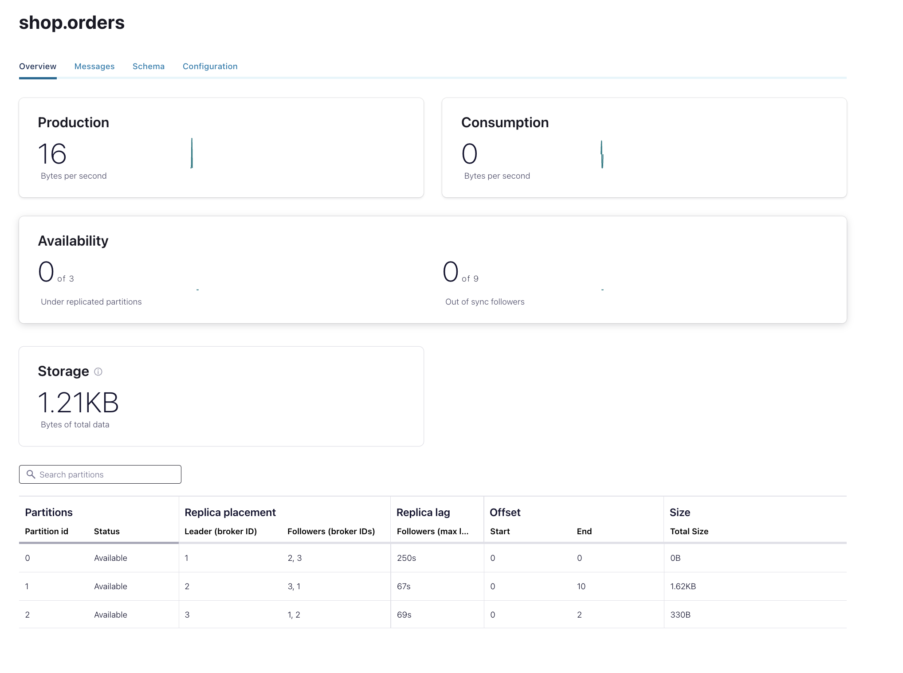

**Control Center - Messages** - 토픽에 저장된 메시지의 JSON 구조를 직접 확인할 수 있습니다.

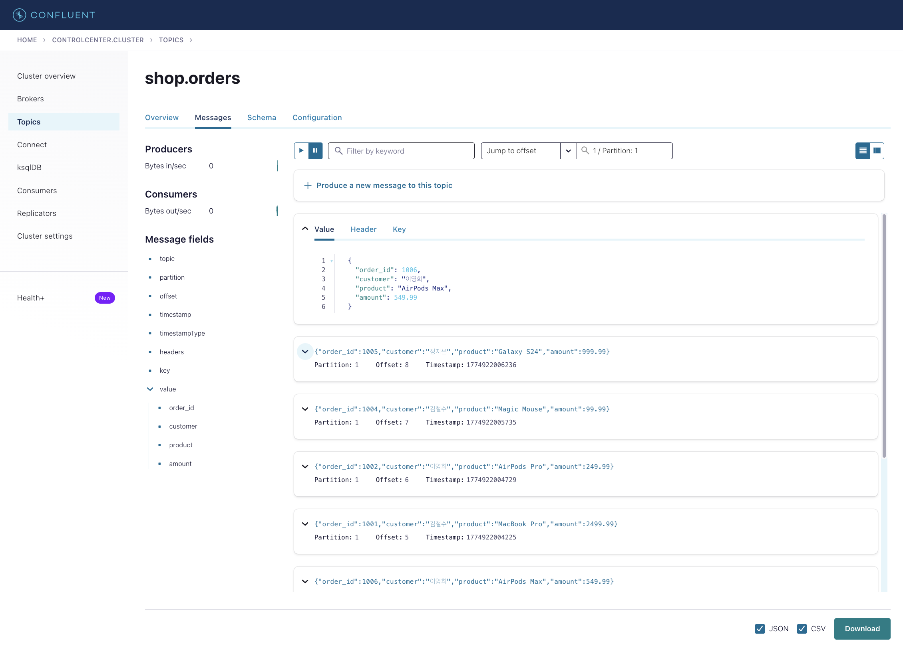

**Producer + Consumer 동시 실행** - Producer가 2초마다 이벤트를 생성하고 Consumer가 실시간으로 소비합니다.

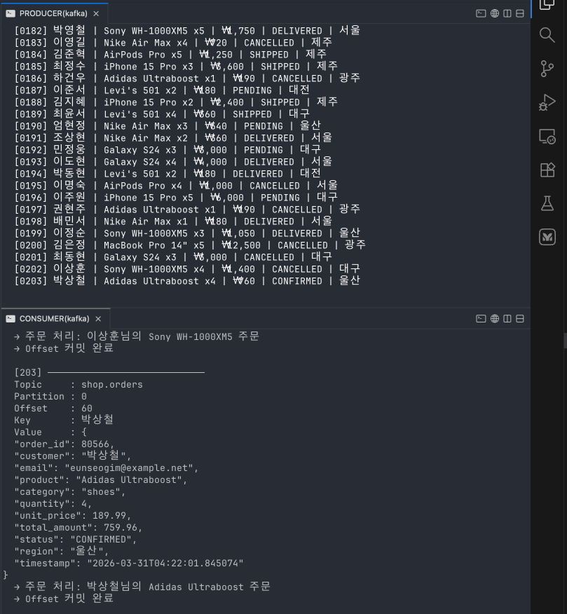

**Control Center - Consumption 탭** - Monitoring Interceptor가 활성화되면 % messages consumed와 End-to-end latency 차트가 표시됩니다. (Producer + Consumer 양쪽 모두 실행 중이어야 차트가 채워집니다)

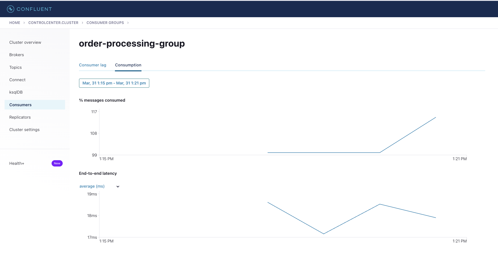

### 핵심 개념 정리

| 개념 | 설명 | 이 실습에서 확인하는 방법 |
|------|------|--------------------------|
| **Key 기반 파티셔닝** | 같은 Key의 메시지는 항상 같은 Partition에 저장 → 순서 보장 | Producer 출력에서 "김철수" 주문 2건이 같은 Partition 번호 |
| **Consumer Group** | 같은 그룹의 Consumer끼리 Partition을 나눠서 병렬 처리 | worker-1, 2, 3이 각각 다른 Partition을 담당 |
| **리밸런싱** | Consumer가 추가/제거되면 Partition을 자동 재분배 | 워커 하나를 Ctrl+C로 종료하면 나머지가 파티션을 인수 |
| **Offset** | Consumer가 어디까지 읽었는지 추적하는 위치값 | Consumer 출력에서 Offset이 0부터 순차 증가 |
| **Offset 커밋** | "여기까지 처리 완료"를 Kafka에 알림 → 재시작 시 이어서 처리 | Consumer 출력의 "Offset 커밋 완료" 메시지 |

---

## Step 2: 실시간 데이터 파이프라인 (CDC)

> **Kafka Connect**와 **Debezium**으로 PostgreSQL의 변경사항을 Kafka에 실시간 캡처합니다.

### CDC (Change Data Capture)란?

데이터베이스의 변경사항(INSERT/UPDATE/DELETE)을 실시간으로 감지하여 이벤트로 전달하는 기술입니다. PostgreSQL의 WAL(Write-Ahead Log)을 읽어서 변경사항을 추출하므로, 애플리케이션 코드를 수정할 필요가 없습니다.

### 실행

```bash
# 2-1. Debezium CDC Connector 등록 (Kafka Connect REST API로 JSON 설정 전송)
docker exec -it python-app python step2_pipeline/01_setup_cdc_connector.py

# 2-2. PostgreSQL에 INSERT/UPDATE/DELETE 수행 → Kafka에 자동 캡처
docker exec -it python-app python step2_pipeline/02_trigger_cdc_events.py

# 2-3. CDC 이벤트 모니터링 (다른 터미널)
docker exec -it python-app python step2_pipeline/03_cdc_consumer.py
```

### 실행 화면

**Debezium Connector 등록** - Kafka Connect REST API로 JSON 설정을 전송하면 Connector가 RUNNING 상태로 시작됩니다.

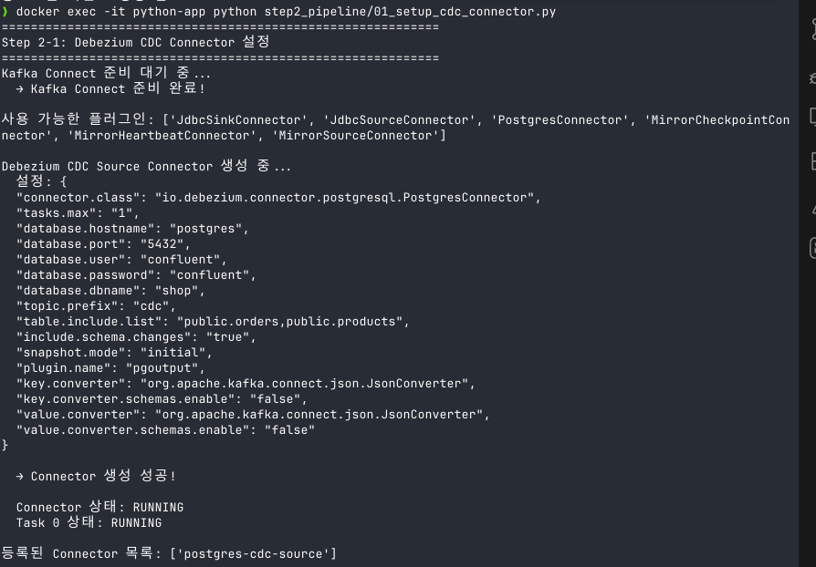

**CDC 이벤트 트리거** - PostgreSQL에 INSERT/UPDATE/DELETE를 수행하면 Debezium이 변경사항을 자동으로 Kafka 토픽에 캡처합니다.

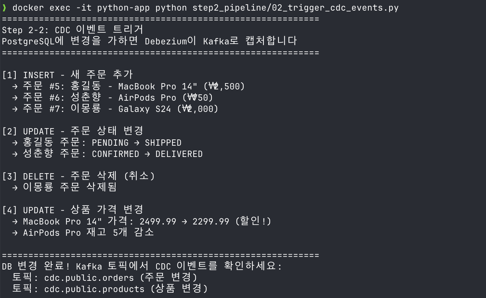

**Connector 상태 확인** - Kafka Connect REST API(`http://localhost:8083/connectors/postgres-cdc-source/status`)로 Connector와 Task의 RUNNING 상태를 확인할 수 있습니다.

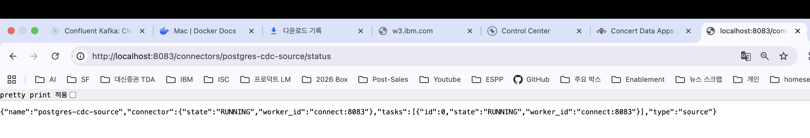

> Control Center의 Connect 탭에서 "No Connect Clusters Found"가 표시될 수 있습니다. 이는 Control Center와 Kafka Connect 간 내부 등록 이슈로, Connector 자체는 정상 동작합니다. Connector 상태는 REST API로 직접 확인하세요:
> ```bash
> # 등록된 커넥터 목록
> curl http://localhost:8083/connectors
> # 특정 커넥터 상태
> curl http://localhost:8083/connectors/postgres-cdc-source/status
> ```

**Control Center - CDC DELETE 이벤트 (cdc.public.orders)** - `op: "d"` (DELETE). `before`에 삭제된 레코드가 있고 `after`는 `null`입니다. 이몽룡의 Galaxy S24 주문이 DB에서 삭제된 것을 Debezium이 캡처한 것입니다.

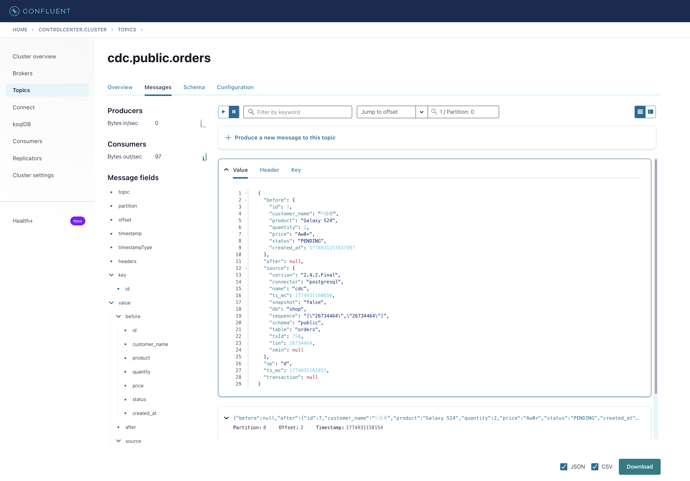

**Control Center - CDC UPDATE 이벤트 (cdc.public.products)** - `op: "u"` (UPDATE). `before`와 `after`를 비교하면 AirPods Pro의 `stock`이 500 → 495로 변경된 것을 확인할 수 있습니다. 애플리케이션 코드 수정 없이 DB 변경이 자동으로 Kafka에 캡처됩니다.

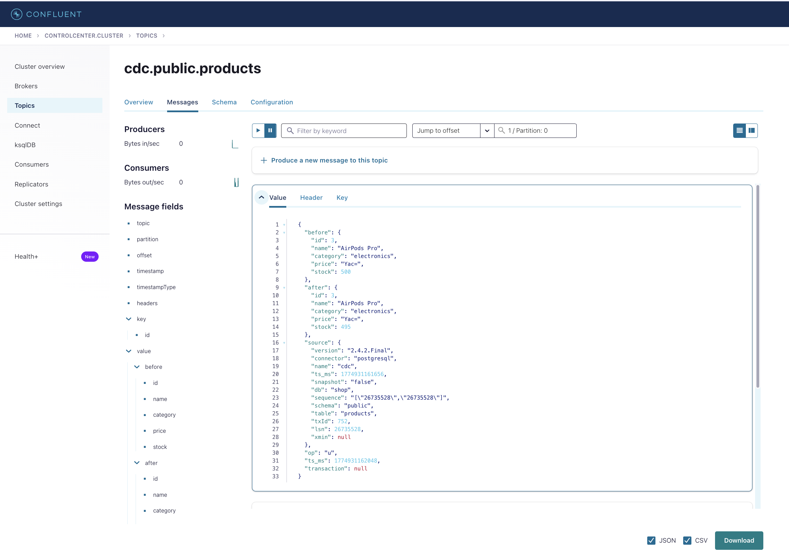

### CDC 이벤트의 before/after 패턴

| 이벤트 | op | before | after | 의미 |
|--------|-----|--------|-------|------|
| 스냅샷 | `r` | `null` | 데이터 | Connector 최초 실행 시 기존 데이터 캡처 |
| INSERT | `c` | `null` | 새 데이터 | 새 레코드 추가 |
| UPDATE | `u` | 변경 전 | 변경 후 | 기존 레코드 수정 (두 값 비교로 변경점 파악) |
| DELETE | `d` | 삭제된 데이터 | `null` | 레코드 삭제 |

### 핵심 개념 정리

| 개념 | 설명 |
|------|------|
| **Kafka Connect** | 외부 시스템 ↔ Kafka 간 데이터를 JSON 설정으로 연동하는 프레임워크 |
| **Source Connector** | 외부 → Kafka 방향 (이 실습: PostgreSQL → Kafka) |
| **Sink Connector** | Kafka → 외부 방향 (예: Kafka → Elasticsearch, S3 등) |
| **Debezium** | DB의 트랜잭션 로그를 읽어 CDC 이벤트를 생성하는 오픈소스 커넥터 |
| **CDC 이벤트 구조** | `op` 필드로 변경 유형 구분: `c`=INSERT, `u`=UPDATE, `d`=DELETE, `r`=스냅샷 |
| **before/after** | UPDATE 시 변경 전(`before`)과 변경 후(`after`) 데이터를 모두 포함 |
| **스냅샷** | Connector 최초 실행 시 기존 DB 데이터를 전부 캡처 (op=`r`) |

---

## Step 3: 스트림 프로세싱 (ksqlDB)

> SQL로 Kafka 토픽의 실시간 데이터를 변환하고 집계합니다.

### ksqlDB란?

Kafka 토픽 위에서 SQL을 실행할 수 있는 스트림 프로세싱 엔진입니다. SQL 쿼리로 실시간 데이터 처리가 가능합니다.

### 실행

```bash
# 먼저 이벤트 생성기를 켜 놓으세요 (별도 터미널)
docker exec -it python-app python step1_basics/04_producer_advanced.py

# 3-1. ksqlDB에 스트림과 테이블 생성
docker exec -it python-app python step3_streaming/01_ksqldb_setup.py

# 3-2. 실시간 대시보드 조회 (5초마다 갱신)
docker exec -it python-app python step3_streaming/02_query_ksqldb.py

# 3-3. ksqlDB CLI에서 직접 SQL 쿼리 실행
docker exec -it ksqldb-cli ksql http://ksqldb-server:8088
# → step3_streaming/ksqldb_queries.sql의 쿼리를 복사해서 실행
```

### 실행 화면

**ksqlDB 스트림/테이블 생성** - SQL 문으로 Kafka 토픽 위에 Stream과 Table을 정의합니다. `ORDERS_STREAM`은 `shop.orders` 토픽을 SQL로 조회 가능하게 만들고, `SALES_BY_CATEGORY`는 1분 단위 Tumbling Window로 카테고리별 매출을 자동 집계합니다.

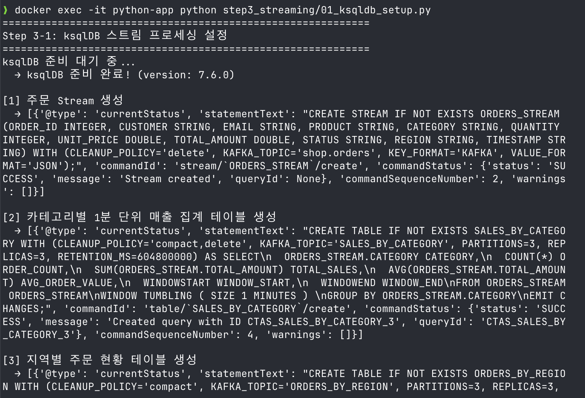

**생성된 Streams와 Tables** - Stream은 이벤트가 흘러가는 로그이고, Table은 집계 결과가 실시간으로 갱신되는 뷰입니다. 각 Stream/Table은 내부적으로 별도의 Kafka 토픽에 결과를 저장합니다.

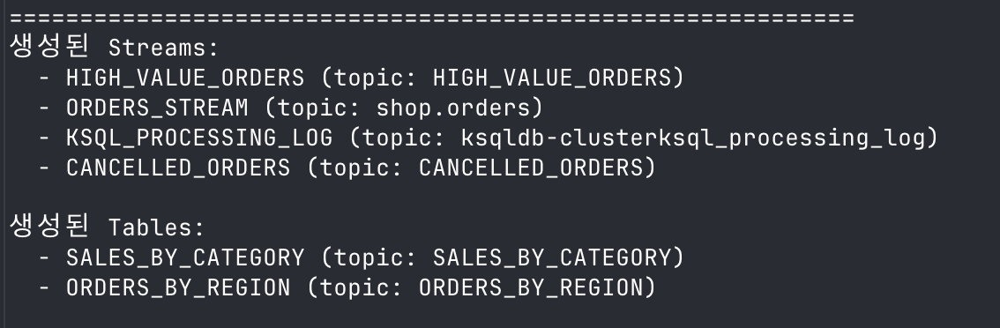

| 생성된 객체 | 유형 | Kafka 토픽 | 역할 |
|------------|------|-----------|------|
| `ORDERS_STREAM` | Stream | shop.orders | 모든 주문 이벤트를 SQL로 조회 |
| `HIGH_VALUE_ORDERS` | Stream | HIGH_VALUE_ORDERS | 500 이상 고가 주문만 필터링 |
| `CANCELLED_ORDERS` | Stream | CANCELLED_ORDERS | 취소 주문만 필터링 |
| `SALES_BY_CATEGORY` | Table | SALES_BY_CATEGORY | 1분 단위 카테고리별 매출 집계 |
| `ORDERS_BY_REGION` | Table | ORDERS_BY_REGION | 지역별 누적 주문 현황 |

**Control Center - ksqlDB Flow 뷰** - `ORDERS_STREAM`을 소스로 4개의 파생 Stream/Table이 어떻게 연결되는지 시각적으로 보여줍니다. 오른쪽 패널에서 `ORDERS_BY_REGION` 테이블의 실시간 집계 결과(지역별 주문 수, 매출)를 확인할 수 있습니다.

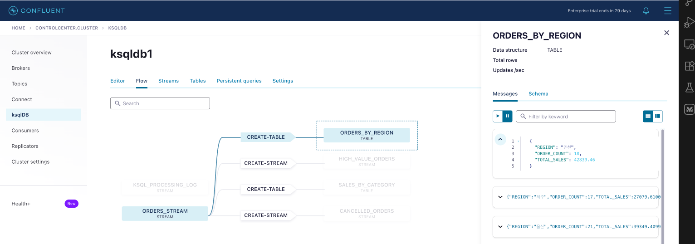

**실시간 집계 대시보드** - 5초마다 ksqlDB의 Table을 Pull Query로 조회하여 지역별 주문 현황과 고가 주문을 표시합니다. Producer가 이벤트를 생성하는 동안 수치가 실시간으로 변화합니다.

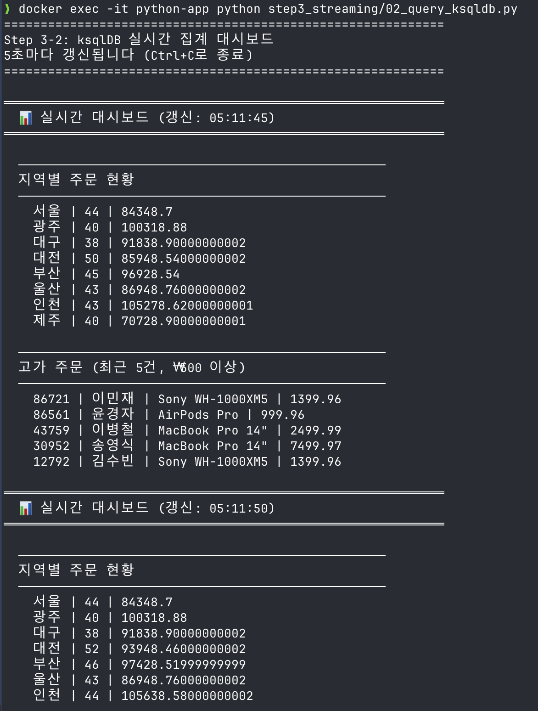

- **지역별 주문 현황** (`ORDERS_BY_REGION`): 지역 | 주문 수 | 총 매출. 5초 후 갱신하면 대전 50→52건, 부산 45→46건 등 실시간으로 수치가 증가하는 것을 확인할 수 있습니다.
- **고가 주문** (`HIGH_VALUE_ORDERS`): ₩500 이상 주문만 자동 필터링. MacBook Pro 3대 주문(₩7,499.97) 등 고액 거래를 실시간으로 감지합니다.

이 대시보드는 ksqlDB의 SQL 쿼리로 구성되었습니다. 배치 집계(시간/일 단위)와 달리, ksqlDB는 이벤트가 도착하는 즉시 집계를 갱신합니다.

**ksqlDB CLI - Push Query** - `EMIT CHANGES`를 붙이면 새 이벤트가 도착할 때마다 결과가 한 줄씩 실시간으로 추가됩니다. Pull Query(1회 조회)와 달리, Push Query는 끊기지 않고 계속 스트리밍됩니다. "실시간 스트림 프로세싱"이 무엇인지 가장 직관적으로 보여주는 기능입니다.

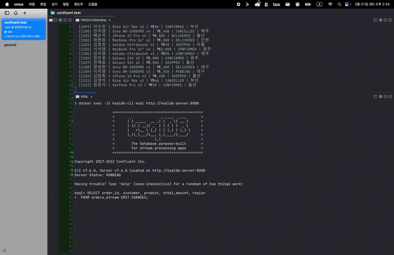

```bash
# ksqlDB CLI 접속
docker exec -it ksqldb-cli ksql http://ksqldb-server:8088

# Push Query 예시 - 새 주문이 올 때마다 즉시 출력
SELECT order_id, customer, product, total_amount, region
FROM orders_stream EMIT CHANGES;

# 30초 단위 카테고리별 매출 실시간 집계
SELECT category, COUNT(*) AS cnt, SUM(total_amount) AS sales
FROM orders_stream
WINDOW TUMBLING (SIZE 30 SECONDS)
GROUP BY category
EMIT CHANGES;
```

### 핵심 개념 정리

| 개념 | 설명 | 예시 |
|------|------|------|
| **Stream** | 끊임없이 흐르는 이벤트 로그 (INSERT only) | `orders_stream` - 모든 주문 이벤트 |
| **Table** | 최신 상태를 유지하는 집계 뷰 (UPSERT) | `orders_by_region` - 지역별 누적 주문 수 |
| **Push Query** | `EMIT CHANGES`로 새 데이터 도착 시 즉시 출력 (무한 스트리밍) | 실시간 주문 모니터링 |
| **Pull Query** | 현재 상태를 1회 조회 | 지역별 주문 현황 스냅샷 |
| **Tumbling Window** | 고정 크기 시간 윈도우로 집계 (겹침 없음) | 1분 단위 카테고리별 매출 |
| **Hopping Window** | 일정 간격으로 슬라이딩하며 집계 (겹침 있음) | 30초 간격 1분 이동 평균 |

---

## Step 4: Avro → JSON 변환 (QRadar 연동 검증)

> Confluent 실무 환경에서 주로 사용하는 **Avro 바이너리 포맷**을, QRadar 같은 텍스트 전용 시스템이 읽을 수 있도록 **JSON으로 변환**하는 파이프라인을 검증합니다.

### 배경

| 항목 | Avro | JSON |
|------|------|------|
| 포맷 | 바이너리 (사람이 읽을 수 없음) | 텍스트 (사람이 읽을 수 있음) |
| 장점 | 컴팩트, 빠름, 스키마 호환성 검증 | 범용 호환, 디버깅 용이 |
| 실무 사용률 | 높음 (플랫폼팀 가이드 권장) | 낮음 (개발/테스트 용도) |
| QRadar 수집 | 불가 (바이너리 파싱 불가) | 가능 |

실무에서는 성능과 스키마 관리 이점 때문에 Avro를 사용하는 경우가 대부분입니다. QRadar처럼 텍스트만 수신 가능한 시스템과 연동하려면 **Avro → JSON 변환 토픽**을 생성해야 합니다.

### 실행

```bash
# 4-1. Avro Producer 실행 (10초 정도 돌린 후 Ctrl+C로 토픽 생성)
docker exec -it python-app python step4_avro_test/01_avro_producer.py

# 4-2. ksqlDB로 Avro → JSON 변환 파이프라인 생성
docker exec -it python-app python step4_avro_test/02_avro_to_json_ksqldb.py

# 4-3. Avro Producer 다시 실행 (별도 터미널, 변환 데이터 생성)
docker exec -it python-app python step4_avro_test/01_avro_producer.py

# 4-4. 변환 결과 검증 (별도 터미널)
docker exec -it python-app python step4_avro_test/03_verify_json.py
```

### 변환 파이프라인 구조

```
Producer (Spring 등)         ksqlDB (포맷 변환)            QRadar
      │                           │                        │
      │  Avro 직렬화               │  포맷 변환              │  JSON 수집
      ▼                           ▼                        ▼
┌──────────────┐  자동 변환  ┌──────────────┐  구독    ┌──────────┐
│shop.orders   │ ─────────→ │shop.orders   │ ──────→ │ QRadar   │
│   .avro      │            │   .json      │         │ Consumer │
│ (바이너리)    │            │ (텍스트)      │         │          │
└──────────────┘            └──────────────┘         └──────────┘
```

### 실행 화면

**Control Center - ksqlDB Flow** - `ORDERS_AVRO` (Avro) → `CREATE-STREAM` → `ORDERS_JSON` (JSON) 변환 파이프라인이 시각적으로 표시됩니다. 오른쪽 패널에서 변환에 사용된 SQL을 확인할 수 있습니다.

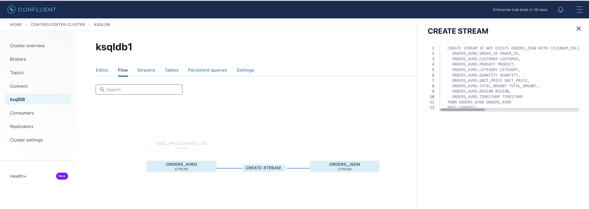

### ksqlDB 변환 SQL

```sql
-- Avro 토픽을 JSON 토픽으로 변환
CREATE STREAM orders_json
WITH (KAFKA_TOPIC = 'shop.orders.json', VALUE_FORMAT = 'JSON')
AS SELECT * FROM orders_avro EMIT CHANGES;
```

기존 Avro 파이프라인에 영향 없이, 변환된 JSON 토픽만 QRadar가 구독하면 됩니다.

### QRadar 모의 테스트 (텍스트 전용 외부 시스템 검증)

QRadar와 동일한 조건(Schema Registry 연동 없는 순수 Kafka Consumer)으로 두 토픽을 읽어서 차이를 검증합니다.

```bash
docker exec -it python-app python step4_avro_test/04_mock_qradar.py
```

| 테스트 | 토픽 | Schema Registry | JSON 파싱 | 결과 |
|--------|------|----------------|-----------|------|
| TEST 1 | shop.orders.avro | 없음 (QRadar 동일 조건) | 실패 (바이너리) | QRadar 수집 불가 |
| TEST 2 | shop.orders.json | 없음 (QRadar 동일 조건) | 성공 (텍스트) | QRadar 수집 가능 |

> **참고**: Control Center에서는 Avro 토픽도 JSON처럼 보입니다. 이는 Control Center가 Confluent 자체 제품이라 Schema Registry를 통해 Avro를 자동 역직렬화하기 때문입니다. QRadar 같은 외부 시스템에는 이 기능이 없으므로 JSON 변환이 필요합니다.

### QRadar 설정 예시

```
Bootstrap Server List: <confluent-broker>:9092
Consumer Group: qradar-siem-group
Topic List: shop.orders.json
```

---

## 프로젝트 구조

```
confluent/
├── config.py                  # 공통 설정 (환경 자동 감지)
├── docker-compose.yml         # Confluent Platform 전체 스택
├── Dockerfile.python          # Python 앱 컨테이너 (Linux + Interceptor)
├── requirements.txt           # Python 의존성
├── init-db/
│   └── init.sql               # PostgreSQL 초기 데이터 (상품/주문)
├── step1_basics/              # Step 1: 이벤트 스트리밍 기초
│   ├── 01_producer.py         #   Producer - 주문 이벤트 전송
│   ├── 02_consumer.py         #   Consumer - 이벤트 소비 + 수동 커밋
│   ├── 03_consumer_group_demo.py  #   Consumer Group 파티션 분배 데모
│   └── 04_producer_advanced.py    #   연속 이벤트 생성기 (Faker)
├── step2_pipeline/            # Step 2: CDC 데이터 파이프라인
│   ├── 01_setup_cdc_connector.py  #   Debezium Connector 등록
│   ├── 02_trigger_cdc_events.py   #   DB 변경 트리거
│   └── 03_cdc_consumer.py     #   CDC 이벤트 모니터 (before/after 비교)
├── step3_streaming/           # Step 3: ksqlDB 스트림 프로세싱
│   ├── 01_ksqldb_setup.py     #   스트림/테이블 생성
│   ├── 02_query_ksqldb.py     #   실시간 대시보드
│   └── ksqldb_queries.sql     #   ksqlDB CLI용 쿼리 모음
├── step4_avro_test/           # Step 4: Avro → JSON 변환 (QRadar 연동 검증)
│   ├── 01_avro_producer.py    #   Avro 바이너리로 이벤트 전송
│   ├── 02_avro_to_json_ksqldb.py  #   ksqlDB로 Avro → JSON 변환
│   ├── 03_verify_json.py      #   변환 결과 비교 검증
│   └── 04_mock_qradar.py      #   QRadar 모의 테스트 (텍스트 전용 Consumer)
└── docs/images/               # 스크린샷
```

---

## 포트 정리

| 서비스 | 포트 | 용도 | 접속 방법 |
|--------|------|------|-----------|
| Control Center | 9021 | 웹 UI 모니터링 | http://localhost:9021 |
| Kafka Broker 1 | 9092 | 메시지 브로커 | Producer/Consumer가 접속 |
| Kafka Broker 2 | 9093 | 메시지 브로커 | |
| Kafka Broker 3 | 9094 | 메시지 브로커 | |
| Schema Registry | 8081 | 스키마 관리 API | http://localhost:8081 |
| Kafka Connect | 8083 | 커넥터 관리 REST API | http://localhost:8083 |
| ksqlDB | 8088 | 스트림 프로세싱 API | http://localhost:8088 |
| PostgreSQL | 5432 | CDC 소스 DB | `psql -h localhost -U confluent -d shop` |
| Zookeeper | 2181 | 클러스터 메타데이터 | 직접 접속 불필요 |

---

## 종료

```bash
# 모든 컨테이너 종료 및 볼륨 삭제 (데이터 초기화)
docker-compose down -v
```
